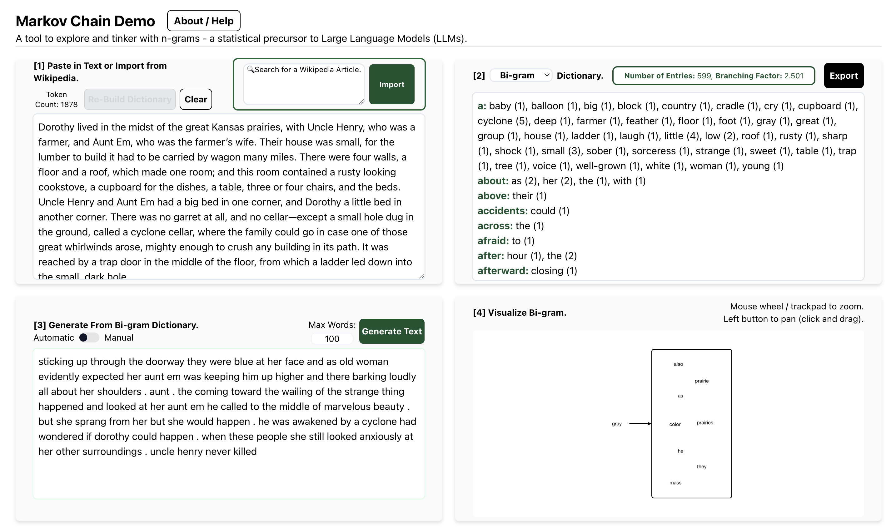

# **Welcome to the Markov Chain Demo!**

Hey there! This is the GitHub repository and code for an interactive browser tool that generates text with Markov Chains.

We've made this tool to help everyone, from K-12 classrooms to researchers, build a better intuition for exactly how next word prediction (a quintessential part of today's large language models) works at its most basic level - creating the foundation from which other, more modern algorithms (like the Transformer architecture) are based off of.

Here's a quick screenshot of what the demo looks like!

You can run a live version of the demo here: [Markov Chain Demo](https://www.cs.cmu.edu/~dst/MarkovChainDemo/)

*P.S. - If you'd like to know more about the demo and Markov Chains, head over to the About/Help menu!*

## Building the Demo Locally.

If you'd like to create your own version of the demo or modify some bits and pieces, here are some key instructions.

1. Install node 20.11.0 and npm 10.2.4. You can find installation instructions for your machine [here](https://docs.npmjs.com/downloading-and-installing-node-js-and-npm).
2. Clone this git repository (namely, the master branch).
3. cd to the repository directory.
4. Install react-scripts via `npm install`.
5. Now that you've finished setting up, start the demo on your localhost (port 3000 by default) via `npm run start`. Make all of your changes and see the updates! You may need to re-load the page after making any modifications.
6. Once you're done, you'll need to actually get your changes ready for production. Run `npm run build` to create deployment-ready files automatically in the `build` directory.
7. You might notice that `build` has an `index.html` file. But, we're serving the app from root, not `build/index.html`! So, copy paste the contents of `build/index.html` into `index.html` in the root directory. **Once you're done this, remember to add `build/` in front of each of the three pathnames, just to make sure that we're pointing to the right files you just compiled.**
8. You're done!

Thanks for checking out the Markov Chain Demo! Please reach out to Aditya Dewan (aditya.dewan124@gmail.com) or Dave Touretzky (dst@cs.cmu.edu) if you have any questions, suggestions, or requests.

## Acknowledgments
This work was supported by National Science Foundation award IIS-2112633.

